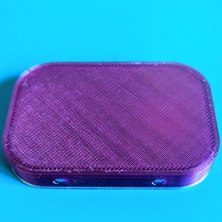
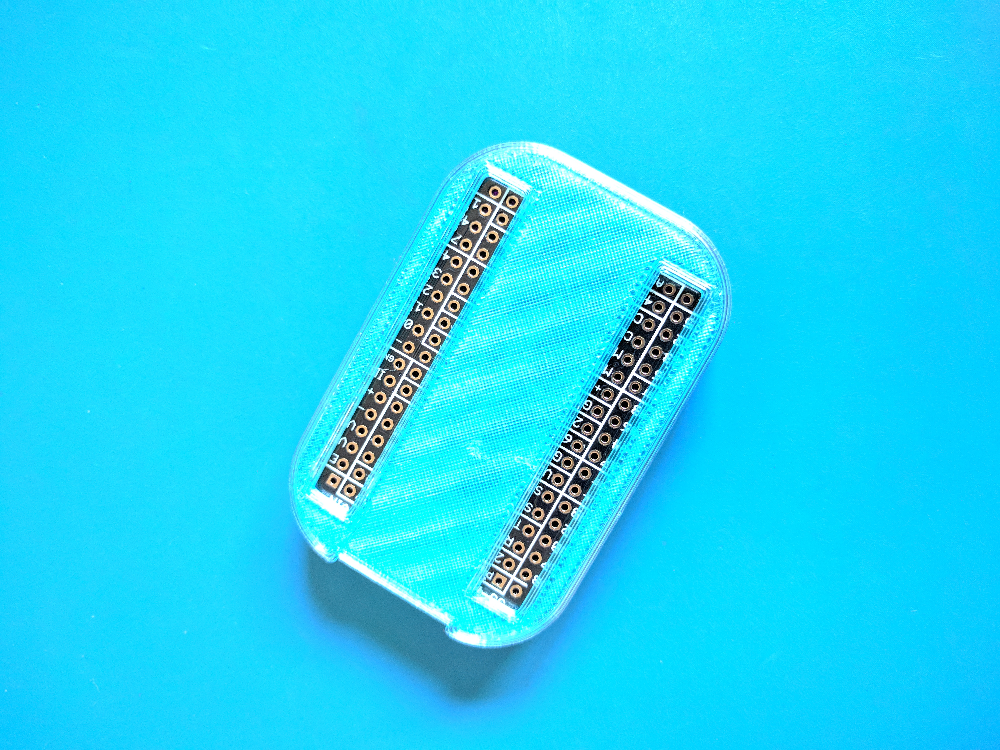

# PocketBeagle Case

Just another case for the BeagleBone.org PocketBeagle A2.

Insert a μSD card into the PocketBeagle. Test that the image/board combination works before continuing. Power down.

Place the PocketBeagle into the case and carefully press (minding the USB port) it down past the retainer bars on both sides.

Put the cap on the case and use.